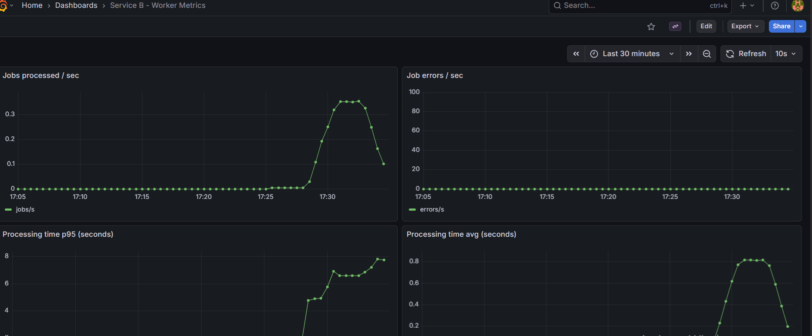
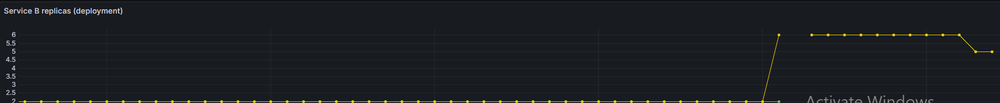
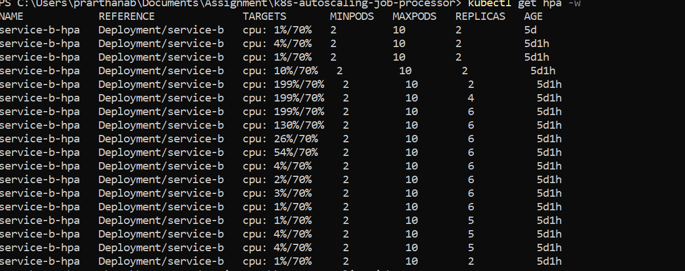

# Kubernetes Microservices Monitoring Assignment

## Project Description

This project demonstrates a microservices-based Node.js system deployed on Kubernetes, designed for scalable, observable, and resilient job processing. The architecture consists of three main services:

- **Service A (Job Submitter/API Gateway):** Receives job submissions from clients via REST API, pushes jobs into a Redis queue, and returns job IDs for tracking.
- **Service B (Worker):** Scalable worker service that consumes jobs from Redis, performs CPU-intensive computations and stores results back in Redis.
- **Service C (Stats/Aggregator):** Aggregates job statistics and queue length from Redis, exposes stats via REST API, and provides Prometheus metrics for monitoring overall system health and throughput.

## DEPLOYMENTS STEPS

1. Start Minikube
minikube start

2. Build Docker images for all services:
docker build -t service-a-job-submitter:latest ./service-a-job-submitter
docker build -t service-b-worker:latest ./service-b-worker
docker build -t service-c-stats:latest ./service-c-stats

3. Apply Kubernetes manifests:
kubectl apply -f k8s/

4. Install Prometheus & Grafana:
helm repo add prometheus-community https://prometheus-community.github.io/helm-charts
helm install monitoring prometheus-community/kube-prometheus-stack --namespace monitoring --create-namespace

5. Port-forward Grafana:
kubectl port-forward svc/monitoring-grafana 3000:80 -n monitoring
Access Grafana at http://localhost:3000

## RUNNING STRESS TEST

1. Find Ingress IP:
kubectl get ingress

2. Run Apache Bench:
ab -n 5000 -c 200 -H "x-api-key: <your-key>" -p job.json -T application/json http://<ingress-ip>/api/jobs/submit

job.json contains:

{
  "type": 1,
  "payload": { "name": "test" }
}

## Stress Test Results






## OBSERVATIONS ON SCALING

* Autoscaling: Service B pods increased from 2 to 10 during load.
* Queue Backlog: Redis queue length grew during stress test, then drained as workers processed jobs.
Metrics:
* Custom metrics (job counts, processing time, errors) updated in real time.
* System Stability: All services remained healthy and responsive.


```mermaid
flowchart TD
    Client((Client))
    A[Service A<br>Job Submitter]
    Redis[(Redis Queue)]
    B[Service B<br>Worker(s)]
    C[Service C<br>Stats/Aggregator]

    Client -->|Submit Job| A
    A -->|Push Job| Redis
    B -->|Pull & Process Job| Redis
    B -->|Save Result| Redis
    C -->|Read Stats| Redis
    Client -->|Get Stats| C

    %% Monitoring
    B -- Metrics --> Prometheus
    C -- Metrics --> Prometheus
    Prometheus -- Dashboards --> Grafana
```
